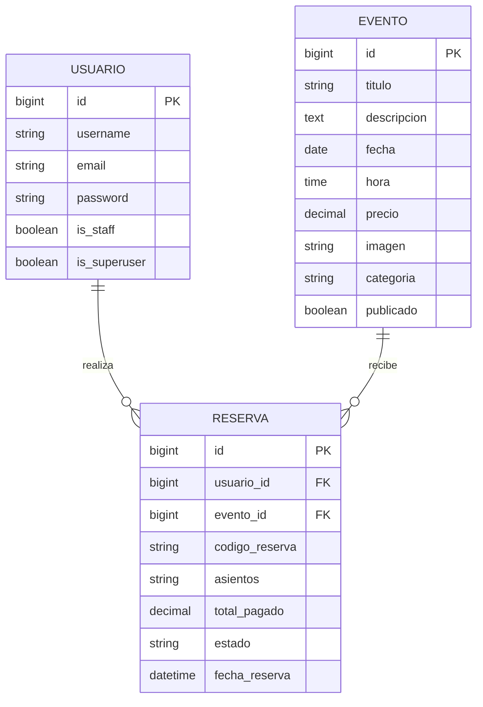

# Arquitectura y Base de Datos

## Arquitectura basica

El proyecto sigue una arquitectura cliente-servidor:

- El cliente es la SPA construida con HTML, CSS, JavaScript y jQuery.
- El servidor es Django, que procesa solicitudes, administra usuarios y expone datos.
- La base de datos es SQLite, integrada con Django.

Flujo general:

1. El usuario abre la interfaz web.
2. JavaScript renderiza las pantallas y solicita la cartelera al backend.
3. Django consulta la base de datos y devuelve los eventos en JSON.
4. El panel administrativo de Django permite crear, editar y eliminar eventos.

## Diagrama Entidad-Relacion

## Tablas principales

### 1. Usuarios

Se usa la tabla de autenticacion de Django (`auth_user`), lo cual evita crear un modelo de usuario desde cero en esta fase.

Campos clave:

- `id`
- `username`
- `email`
- `password`
- `is_staff`
- `is_superuser`

Roles:

- Usuario normal: puede registrarse, iniciar sesion y reservar.
- Administrador: `is_staff=True`, puede entrar al admin y gestionar informacion.
- Administrador avanzado: `is_superuser=True`, control total del sistema.

### 2. Eventos

Representa cada obra, concierto, musical o recital disponible para reserva.

Campos clave:

- `id`
- `titulo`
- `descripcion`
- `fecha`
- `hora`
- `precio`
- `imagen`
- `categoria`
- `publicado`

### 3. Reservas

Guarda la relacion entre un usuario y un evento reservado.

Campos clave:

- `id`
- `usuario_id`
- `evento_id`
- `codigo_reserva`
- `asientos`
- `total_pagado`
- `estado`
- `fecha_reserva`

## Traduccion a modelos de Django

La estructura anterior se implementa en [teatro_backend/api/models.py](/c:/Users/Jose/Downloads/Teatro%20Nacional%20Reserva%20Boletos/teatro_backend/api/models.py).

- `Usuario`: se reutiliza el modelo integrado de Django.
- `Evento`: modelo propio para la cartelera.
- `Reserva`: modelo propio con claves foraneas a usuario y evento.

Relaciones en Django:

- Un usuario puede tener muchas reservas.
- Un evento puede tener muchas reservas.
- Cada reserva pertenece a un solo usuario y a un solo evento.

