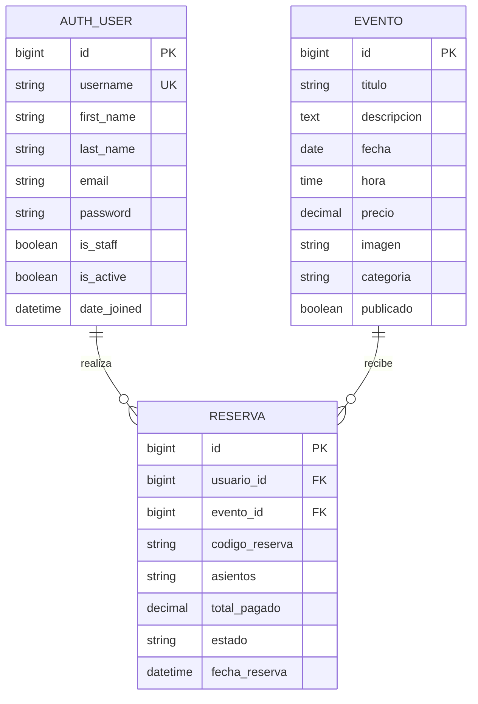

# Diagrama Entidad-Relacion

## Modelo de base de datos actual

## Estructura base

- `Usuarios`: se reutiliza `auth_user` de Django.
- `Eventos`: cartelera disponible, categoria, precio, fecha y estado de publicacion.
- `Reservas`: relaciona un usuario con un evento, registra asientos, total pagado y estado.

## Nota tecnica

- En esta entrega, `asientos` se guarda como texto separado por comas para mantener el backend simple.
- Si luego quieren bloqueo real de butacas, conviene crear tablas separadas para `Asiento` y `ReservaAsiento`.
